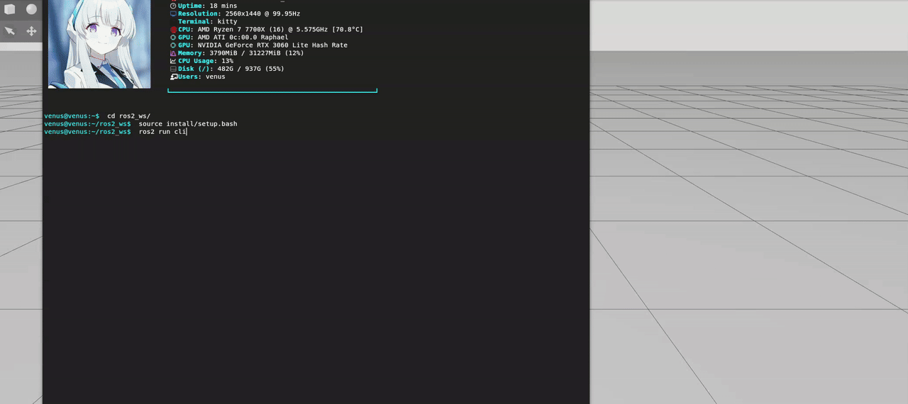

# Project Title
Robotic Arm control for grasping an object at a fixed location in Gazebo.


# Overview
This project simulates a robotic arm grasping an object in a simulation environment
using Gazebo and ROS 2. A Genetic Algorithm (GA) and Neural Network (NN) are applied to train the robot
to learn how to grasp the object autonomously.

# Objectives
The objectives of this project :
- To integrate a robotic arm into a simulation environment.
- To control the robotic arm using ROS 2 and Gazebo.
- To apply a Genetic Algorithm (GA) and a Neural Network (NN) to enable the robot to grasp a specific object at a fixed location.
# Idea
- The system consists of a robotic arm simulated in Gazebo and controlled through ROS 2.
  A Neural Network (NN) is used as the robot controller, which receives state information
  from the simulation environment and outputs control commands for the robotic arm.

- Instead of using gradient-based backpropagation, a Genetic Algorithm (GA) is employed
  to optimize the Neural Network weights. In this approach, each individual in the GA
  population represents a complete set of NN weights.

- During each generation, the NN controller corresponding to an individual is executed
  in the simulation environment. The robot’s behavior is evaluated using a fitness
  function based on its ability to grasp an object at a fixed location. Based on the
  fitness values, the GA performs selection, crossover, and mutation to evolve the
  population toward improved grasping performance.

- This process iteratively updates the NN weights through evolutionary optimization
  until a satisfactory grasping behavior is achieved or a stopping criterion is met.

# System Requirements
- Operating System: Ubuntu 24.04
- ROS2 Jazzy
- Gazebo Harmonic
- Python
- ROS 2 packages for robot simulation and control
- NumPy ( For Genetic Algorithm and Neural Network)
# Usage
## 1. Clone the repository
```bash
git clone https://github.com/TiemDang/robot-arm-grasping-using-gazebo-ros2.git
```
- Move directory robot-arm-grasping-using-gazebo-ros2 to ~/<ros2_workspace>/src
```bash
mv robot-arm-grasping-using-gazebo-ros2 ~/<your_ros2_workspace_name>/src/
```


## 2. Build the ROS 2 workspace
```bash
source /opt/ros/<ros2_version>/setup.bash
cd <your_ros2_workspace_name>
colcon build --packages-select cli_spawn
source install/setup.bash
```


## 3. Launch the simulation world
```bash
ros2 launch cli_spawn empty_world.launch.py 
```
This will start the Gazebo simulation with the robotic arm loaded into the environment.


## 4. Run the learning process
### 4.1 Declare where to save results.
```bash 
cd ~/<your_ros2_workspace_name>/src/robot-arm-grasping-using-gazebo-ros2/cli_spawn
```
- Open file ga_calc.py
- Modify the following line to specify the directory for saving training results:
```bash 
 self.save_dir = " <your/save/path> "
``` 

### 4.2 Bridge parameter
Open new terminal
```bash
source /opt/ros/<ros2_version>/setup.bash
ros2 run ros_gz_bridge parameter_bridge /world/default/control@ros_gz_interfaces/srv/ControlWorld /world/default/set_pose@ros_gz_interfaces/srv/ControlWorld
```


### 4.3 Run the Genetic Algorithm node.
Open new terminal
```bash
cd <your_ros2_workspace_name>
source install/setup.bash
ros2 run <packages_name> ga_calc
```


### 4.4 Run the end position reader node
Open new terminal
```bash
cd <your_ros2_workspace_name>
source install/setup.bash
ros2 run <packages_name> read_end_point
```


### 4.5 Run the robot control node.
Open new terminal
```bash
cd <your_ros2_workspace_name>
source install/setup.bash
ros2 run cli_spawn control_position
```


## 5. Test training results
```bash
cd ~/<your_ros2_workspace_name>/src/robot-arm-grasping-using-gazebo-ros2/cli_spawn
```
- Open file test_control.py
- Modify the following line to specify the trained model file: 
```bash
self.file_name = "<your/save/path/model_name.pkl>"
```
- Open new terminal
```bash
cd <your_ros2_workspace_name>
source install/setup.bash
ros2 run cli_spawn test_control
```
This will visualize the trained grasping result in the Gazebo simulation.


# Results

# Note
The robot URDF file used in this project is not my original work.
It was obtained from the following YouTube video and is used for
educational and research purposes only:

- https://www.youtube.com/watch?v=jsSuntiQZUg
